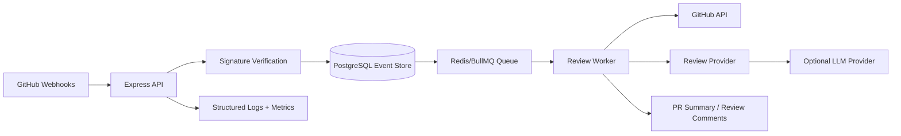

# AI Code Review Agent

AI Code Review Agent is a GitHub-integrated developer productivity service that receives pull request webhooks, records idempotent review events, and produces deterministic review findings that can later be replaced or augmented by LLM providers.

The project is designed as a production-style portfolio system: secure webhook intake, async-ready event boundaries, retry-friendly storage, deterministic local behavior, tests, CI, and clear extension points for GitHub API and LLM integrations.

## Problem Statement

Engineering teams lose time on repetitive pull request review work: identifying risky diffs, missing tests, large change sets, secret handling, and unclear follow-up tasks. This service demonstrates how to build a code review agent around reliable event intake, auditability, and provider abstractions instead of a fragile one-off bot.

## Architecture



## Features

- Express/TypeScript service skeleton
- GitHub webhook signature verification with `x-hub-signature-256`
- Pull request webhook normalization and validation
- Idempotent in-memory review event store for the first local slice
- Deterministic review provider for offline development and CI
- Heuristics for large diffs, missing tests, temporary debug markers, and secret-handling review
- Health endpoint with stored event count
- Docker Compose for PostgreSQL and Redis
- GitHub Actions CI for linting, typechecking, and tests
- System design documentation with scaling, reliability, and security notes

## Tech Stack

- Node.js 22
- TypeScript
- Express
- Zod
- Vitest
- ESLint
- PostgreSQL
- Redis/BullMQ planned
- GitHub Actions

## Local Setup

```bash
cp .env.example .env
npm install
npm run dev
```

The API runs on `http://localhost:8080` by default.

Start local infrastructure once Docker is available:

```bash
docker compose up -d
```

## Environment Variables

| Variable | Purpose | Example |
| --- | --- | --- |
| `APP_ENV` | Runtime environment label | `local` |
| `PORT` | HTTP port | `8080` |
| `GITHUB_WEBHOOK_SECRET` | Shared secret for GitHub webhook verification | `replace-with-local-secret` |
| `DATABASE_URL` | PostgreSQL connection string | `postgresql://...` |
| `REDIS_URL` | Redis connection string | `redis://localhost:6379/0` |
| `LLM_PROVIDER` | Review provider selector | `mock` |

## API Examples

```bash
curl http://localhost:8080/health
```

GitHub webhook delivery requires a valid `x-hub-signature-256` header generated from the raw request body and `GITHUB_WEBHOOK_SECRET`.

```bash
curl -X POST http://localhost:8080/webhooks/github \
  -H "Content-Type: application/json" \
  -H "X-GitHub-Event: pull_request" \
  -H "X-GitHub-Delivery: local-delivery-id" \
  -H "X-Hub-Signature-256: sha256=..." \
  -d '{"action":"opened","repository":{"full_name":"org/repo","html_url":"https://github.com/org/repo"},"pull_request":{"number":1,"title":"Example","html_url":"https://github.com/org/repo/pull/1","user":{"login":"octocat"},"head":{"sha":"abc","ref":"feature"},"base":{"sha":"def","ref":"main"},"changed_files":1,"additions":10,"deletions":2,"body":"Adds tests."}}'
```

## Testing

```bash
npm run lint
npm run typecheck
npm test
```

## Scaling Considerations

- Keep webhook handlers fast and move review work into a queue.
- Use idempotency keys from GitHub delivery IDs to avoid duplicate review comments.
- Store normalized event payloads separately from generated review results.
- Rate-limit GitHub API writes and batch comment updates where practical.
- Use provider abstractions so deterministic local review, LLM review, and hybrid review can share one pipeline.

## Reliability Considerations

- Reject unsigned or incorrectly signed webhook requests.
- Persist received events before queueing downstream work.
- Use retry and dead-letter queues for transient GitHub or provider failures.
- Track review attempts, terminal failure state, and last error for every delivery.
- Make comment publishing idempotent per delivery and head SHA.

## Security Considerations

- No secrets are committed; use `.env` locally and managed secrets in CI or hosting.
- Validate GitHub webhook signatures against the raw request body.
- Store installation tokens encrypted or retrieve them just-in-time through GitHub App auth.
- Avoid logging full diffs by default because code may contain proprietary data.
- Keep LLM provider calls behind explicit configuration and redact secrets before prompts.

## Future Improvements

- PostgreSQL-backed event store and migrations
- Redis/BullMQ review worker with retries and dead-letter handling
- GitHub App authentication and PR comment publishing
- Pull request diff retrieval through GitHub API
- LLM review provider constrained by deterministic policy checks
- Audit log and review attempt dashboard
