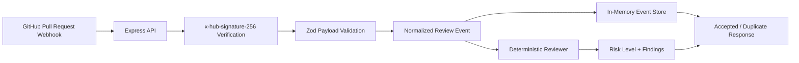

# AI Code Review Agent

GitHub webhook service for automated pull request triage. It verifies signed GitHub webhook deliveries, normalizes pull request events, stores deliveries idempotently, and returns deterministic review findings that flag risky change patterns.

This project is built as a developer productivity portfolio piece. It demonstrates the backend foundation for a code review agent before layering in GitHub App publishing, queues, persistent storage, and LLM review providers.

## Why This Exists

Engineering teams lose time on repetitive pull request review checks: large changes, missing tests, temporary debug code, and secret-handling risks. A useful review agent needs reliable event intake, idempotency, auditability, and deterministic policy checks before it starts calling an LLM.

This repo focuses on that foundation:

- secure GitHub webhook verification
- pull request payload validation and normalization
- idempotent delivery handling
- deterministic review findings
- testable provider boundaries
- CI-friendly local behavior

## Architecture



The first implementation keeps storage in memory and review execution inline so local development and CI stay dependency-free. The system design intentionally leaves clean extension points for PostgreSQL persistence, BullMQ workers, GitHub App authentication, diff retrieval, and LLM-assisted review.

## What Reviewers Should Notice

- Express/TypeScript service with narrow route boundaries.
- Raw request body preservation for GitHub HMAC validation.
- `x-hub-signature-256` verification before payload processing.
- Zod schema validation for pull request webhook payloads.
- Normalized internal event model separate from GitHub's raw payload shape.
- Idempotent event store keyed by GitHub delivery ID.
- Deterministic reviewer with explicit findings, severity, recommendations, and risk levels.
- Tests covering signature verification, webhook behavior, duplicate handling, health checks, and reviewer rules.
- Lint, typecheck, and test scripts ready for CI.

## Features

- `GET /health` returns service status, environment, and stored event count.
- `POST /webhooks/github` accepts signed GitHub `pull_request` events.
- Unsupported signed GitHub event types return `202` without processing.
- Duplicate delivery IDs return the original review result without creating another stored event.
- Review rules flag:
  - large change sets
  - missing test changes
  - debug or placeholder markers
  - secret-handling patterns
- Docker Compose includes PostgreSQL and Redis for the planned persistent/queued path.

## Tech Stack

- Node.js 22
- TypeScript
- Express
- Zod
- Vitest
- Supertest
- ESLint
- PostgreSQL planned
- Redis/BullMQ planned
- GitHub Actions

## Repository Tour

```text
src/http/             Express app and webhook route wiring
src/github/           GitHub signature verification and event normalization
src/review/           Deterministic review provider and finding model
src/storage/          Review event store interface and in-memory implementation
src/config/           Environment-driven settings
tests/                Unit and API tests
docs/                 System design and production tradeoffs
docker-compose.yml    Local PostgreSQL and Redis services for future persistence work
```

## Local Setup

Install dependencies:

```bash
npm install
```

Create an environment file:

```bash
cp .env.example .env
```

Run the API:

```bash
npm run dev
```

The service listens on `http://localhost:8080` by default.

Health check:

```bash
curl http://localhost:8080/health
```

Start local infrastructure for future persistence/queue work:

```bash
docker compose up -d
```

## Demo Flow

GitHub webhook delivery requires a valid `x-hub-signature-256` header generated from the raw request body and `GITHUB_WEBHOOK_SECRET`.

Create a sample body:

```bash
export BODY='{"action":"opened","repository":{"full_name":"Zayedkz/example","html_url":"https://github.com/Zayedkz/example"},"pull_request":{"number":7,"title":"Add webhook handler","html_url":"https://github.com/Zayedkz/example/pull/7","user":{"login":"zayedkz"},"head":{"sha":"abc123","ref":"feature/webhook"},"base":{"sha":"def456","ref":"main"},"changed_files":25,"additions":900,"deletions":40,"body":"This PR uses process.env.GITHUB_TOKEN and has TODO follow-up work."}}'
```

Generate the signature:

```bash
SIGNATURE=$(node -e 'const crypto = require("crypto"); const body = process.env.BODY; const secret = process.env.GITHUB_WEBHOOK_SECRET || "local-development-secret"; console.log("sha256=" + crypto.createHmac("sha256", secret).update(body).digest("hex"));')
```

Post the webhook:

```bash
curl -X POST http://localhost:8080/webhooks/github \
  -H "Content-Type: application/json" \
  -H "X-GitHub-Event: pull_request" \
  -H "X-GitHub-Delivery: local-delivery-id" \
  -H "X-Hub-Signature-256: $SIGNATURE" \
  -d "$BODY"
```

Expected behavior:

- The first delivery returns `202` with `accepted: true`, `duplicate: false`, and deterministic findings.
- Reusing the same delivery ID returns `200` with `duplicate: true`.
- Invalid signatures return `401`.

## Environment Variables

| Variable | Purpose | Example |
| --- | --- | --- |
| `APP_ENV` | Runtime environment label | `local` |
| `PORT` | HTTP port | `8080` |
| `GITHUB_WEBHOOK_SECRET` | Shared secret for GitHub webhook HMAC verification | `replace-with-local-secret` |
| `DATABASE_URL` | Reserved PostgreSQL connection string for the persistent event store | `postgresql://...` |
| `REDIS_URL` | Reserved Redis connection string for queued review jobs | `redis://localhost:6379/0` |
| `LLM_PROVIDER` | Reserved review provider selector | `mock` |

## Testing

```bash
npm run lint
npm run typecheck
npm test
```

## Design Notes

More detail is available in [docs/system-design.md](docs/system-design.md).

Key tradeoffs:

- Deterministic rules are less flexible than LLM review, but they make behavior auditable and reproducible.
- In-memory storage keeps the first slice simple and testable; PostgreSQL is required for real deployments.
- Inline review makes local webhook behavior easy to inspect; production review work should move into a queue.
- The current route uses pull request metadata and PR body text as a stand-in for diff content. A GitHub App integration should fetch file patches and publish/update review comments idempotently.

## Future Improvements

- Add PostgreSQL-backed event storage and migrations.
- Add Redis/BullMQ review jobs with retries and dead-letter handling.
- Add GitHub App installation authentication.
- Retrieve pull request file diffs from GitHub.
- Add an LLM provider behind the deterministic policy checks.
- Publish or update a single PR review summary comment per delivery/head SHA.
- Add an audit endpoint for review delivery status and findings.
